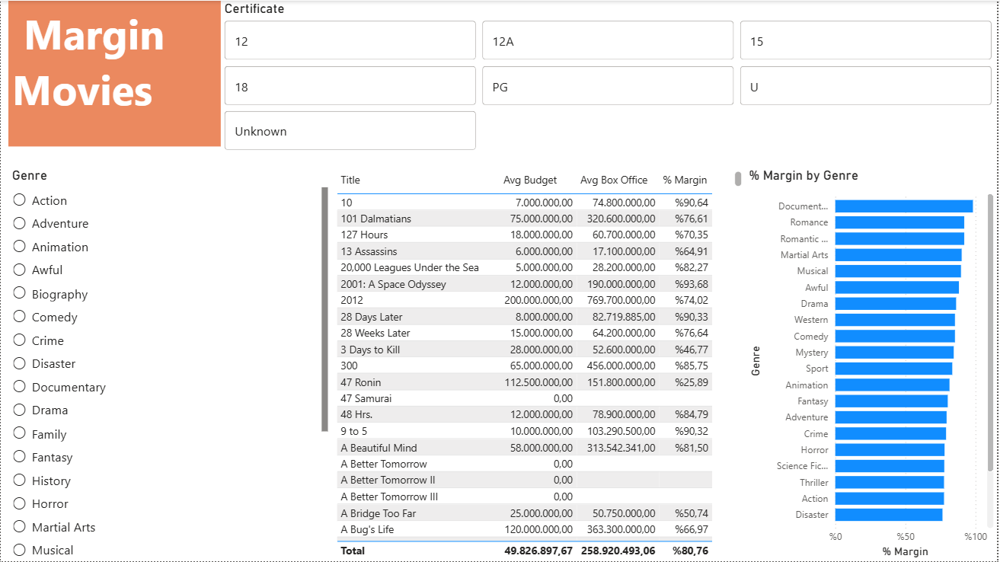

# 🎬 Power BI – DAX Film Analysis: What Makes a Profitable Movie?

A data modeling and visualization project using Power BI and DAX, analyzing a film dataset to uncover which genres and certificate ratings deliver the best return on investment.

## 📊 Project Overview

This project answers a key question for any film studio or investor: **"Where should you put your money to maximize profit?"**

Using a dataset of 999+ films, we built an interactive dashboard that breaks down budget spend, box office revenue, and profit margins by genre and certificate rating — using DAX measures to calculate both weighted and non-weighted profit margins.

## 🗂️ Dataset

| File | Description |
|------|-------------|
| `List of films.xlsx` | 999+ films with title, genre, certificate, budget, box office, runtime, and Oscar nominations/wins (3 sheets: Films, Genre, Certificate) |

## 🛠️ Steps Performed

### 1. Data Import
- Imported all 3 sheets from `List of films.xlsx` into Power BI Desktop
- Removed duplicate queries (Certificate1, Genre2) in Power Query Editor

### 2. Data Cleaning (Power Query Editor)
- Verified column data types across Films, Certificate, and Genre tables
- Replaced `null` values in `BudgetDollars` column with `0` to avoid skewed averages

### 3. Data Modeling
- Verified auto-detected relationships in Model View (Star Schema):
  - Genre (1) → Films (*) via GenreID
  - Certificate (1) → Films (*) via CertificateID

### 4. DAX Measures
Created a dedicated **Measures** table with the following:

| Measure | Formula | Description |
|---------|---------|-------------|
| `Avg Box Office` | `AVERAGE(Films[BoxOfficeDollars])` | Average box office revenue per film |
| `Avg Budget` | `AVERAGE(Films[BudgetDollars])` | Average budget spend per film |
| `% Margin` | `DIVIDE(Avg Box Office - Avg Budget, Avg Box Office)` | Weighted profit margin (aggregate level) |
| `Avg Profit Margin %` | `AVERAGEX(Films, DIVIDE(BoxOffice - Budget, BoxOffice))` | Non-weighted average margin (each film counts equally) |

> 💡 The difference between `% Margin` and `Avg Profit Margin %` is significant: weighted margin is dominated by big-budget blockbusters, while non-weighted gives equal voice to every film regardless of size.

### 5. Dashboard
Built an interactive **Margin Movies** dashboard with:
- **Genre Slicer** — filters the film table only (not the bar chart, to preserve genre comparison)
- **Certificate Slicer** — filters all visuals
- **Film Table** — Title, Budget, Box Office, % Margin per film
- **Bar Chart** — Average profit margin % (non-weighted) by Genre

## 📈 Key Insights

### 🏆 Most Profitable Genres
- **Documentary (~99% margin)** — almost zero budget, surprisingly solid box office. The most capital-efficient genre by far.
- **Romantic Comedy (~92%) and Romance (~92%)** — low production costs with strong audience appeal. Consistently high returns.
- **Awful genre (~88%)** — niche but surprisingly profitable, likely due to very low budgets.

### ⚠️ Genres to Avoid
- **Western (-163% margin)** — the most loss-making genre. High production costs, very low box office returns. Investing here is a financial risk.
- **Biography (~58%) and Crime (~56%)** — expensive to produce but returns are below average compared to other genres.
- **Science Fiction (~53%) and History (~50%)** — high budgets don't always translate to proportional box office.

### 🎟️ Certificate Insights
- **U-rated films** generate the highest average box office — wide audience appeal drives volume.
- **18-rated films** also perform strongly, suggesting adult-themed content attracts dedicated audiences willing to pay.
- **Unknown certificate** films have 100% margin — likely low-budget independent films with minimal distribution costs.

### 📐 Weighted vs Non-Weighted Margin
- Overall **% Margin: 80.76%** vs **Avg Profit Margin %: 61.26%**
- The gap reveals that a few high-budget blockbusters inflate the weighted average — the average film actually delivers a lower margin than the headline number suggests.

## 🖼️ Preview

## 🧰 Tools Used

- Microsoft Power BI Desktop
- DAX (Data Analysis Expressions)
- Power Query Editor
- Excel (.xlsx)
